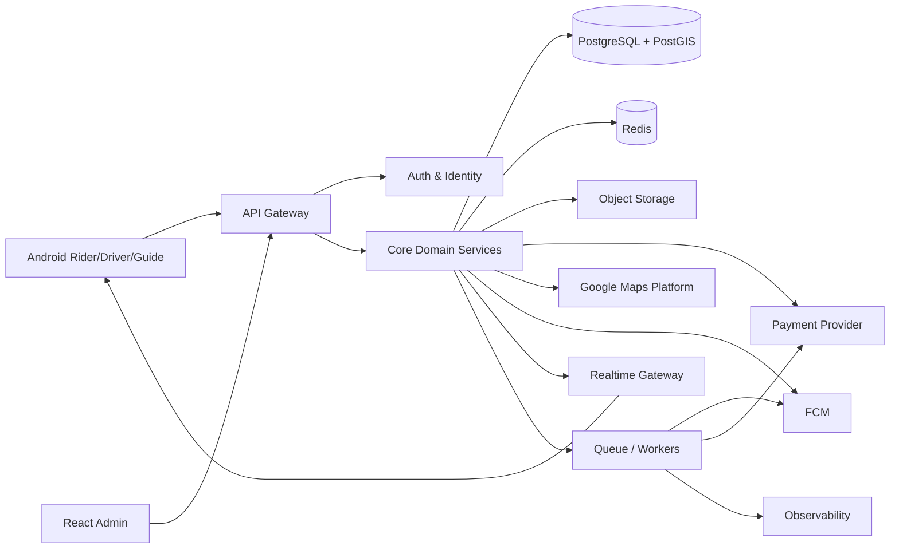

# System Architecture

## 1. High-level architecture

## 2. Architectural style
Start as a modular monolith with clear domain boundaries, then extract high-scale components when justified. This reduces operational complexity while preserving service boundaries.

## 3. Backend domains
- Identity/Auth
- Users/Roles
- Rider
- Driver
- Guide
- Verification
- Vehicles/Documents
- Pricing
- Ride/Trip
- Dispatch
- Payments
- Earnings
- Notifications
- Safety/Emergency
- Trusted Contacts
- Support
- Promotions
- Admin/RBAC
- Analytics/Audit

## 4. Source of truth
PostgreSQL is authoritative for durable domain state. Redis is for caching, locks, ephemeral presence and pub/sub. Object storage holds private documents. Clients never decide authoritative state.

## 5. Location architecture
Use PostGIS for geospatial queries. Store location events with retention controls. Use Redis for current online presence where appropriate. Restrict precision based on purpose.

## 6. Dispatch architecture
- Candidate query using geospatial index.
- Eligibility filtering.
- Weighted ranking.
- Short-lived reservation/lease to avoid double assignment.
- Acceptance timeout.
- Retry with backoff.
- Assignment event persisted before notification.

## 7. Realtime
WebSocket gateway authenticates a session, subscribes clients to authorized channels and publishes domain events. Reconnect requires state reconciliation from REST/API before resuming realtime.

## 8. Background jobs
Use workers for:
- notification retries
- document expiry reminders
- payment reconciliation
- cleanup/retention
- analytics aggregation
- emergency escalation timers
- scheduled operational messages

## 9. Reliability
- Idempotency keys for create-booking and payment operations.
- Database transactions around state transitions.
- Optimistic concurrency/version checks.
- Distributed locks only where necessary.
- Dead-letter queues.
- Graceful degradation.

## 10. Deployment
Separate dev/staging/prod. Use secrets manager, private database networking, autoscaling app workers and managed observability.
## Localization architecture
Add a Localization/Language domain with a server-managed language catalog, locale resolution, user preference, region recommendations and localized notification templates. Explicit user preference has highest priority; location is recommendation-only.
