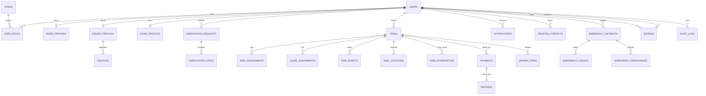

# Database Schema

## 1. Core entities

## 2. Key tables
### users
id, phone, email, name, avatar_url, status, created_at, updated_at, deleted_at.

### roles / user_roles
Role catalog plus per-user role status, verification status and suspension metadata.

### rider_profiles
user_id, preferred_language, emergency_preferences, profile metadata.

### driver_profiles
user_id, license reference, service categories, availability, verification_status, rating aggregate.

### guide_profiles
user_id, languages, categories, service areas, experience, pricing, availability, verification_status.

### vehicles
id, driver_id, type, make/model, registration reference, status, compliance metadata.

### documents
id, owner_id, document_type, private_object_key, checksum, expiry_date, verification_status.

### verification_requests / verification_steps
Track each role's independent verification lifecycle and evidence.

### rides
id, rider_id, purpose, pickup geometry, destination geometry, route summary, quoted fare, final fare, status, payment_status, timestamps, version.

### ride_assignments / guide_assignments
ride_id, provider_id, state, offered_at, accepted_at, rejected_at, timeout_at.

### ride_events
Append-only event history for every important state transition.

### ride_locations
ride_id, actor_id, timestamp, geometry, accuracy, source; enforce retention policy.

### payments / refunds
Provider IDs, amount, currency, method, state, verification timestamps, webhook metadata.

### earnings
provider_id, ride_id, gross, commission, tax, adjustments, net, settlement state.

### emergency_incidents
id, rider_id, ride_id, category, state, trigger_source, location snapshot, heartbeat snapshot, timestamps.

### emergency_events / emergency_responders
Append-only incident timeline and controlled responder assignments.

### trusted_contacts / shared_trips
Relationship, consent state, invitation state, expiry and access scope.

### notifications
recipient, type, priority, payload reference, delivery state, acknowledgement state, retry count.

### audit_logs
actor, action, entity, entity_id, before/after references, IP/device metadata where appropriate, timestamp.

## 3. Database rules
- Use UUIDs or equivalent non-sequential public identifiers.
- Use PostGIS geometry with SRID 4326 for geographic data.
- Index status + timestamps for operational queries.
- GiST indexes for geospatial search.
- Foreign keys and check constraints for critical invariants.
- Soft deletion only where required; apply retention rules.
- Encrypt highly sensitive values at application/storage layer.
- Never store raw card data.
## Language tables
Add `languages`, `language_regions`, `user_language_preferences`, `provider_languages`, `translation_keys` and `translations`. Keep UI language preference separate from Driver/Guide spoken-language capability.
