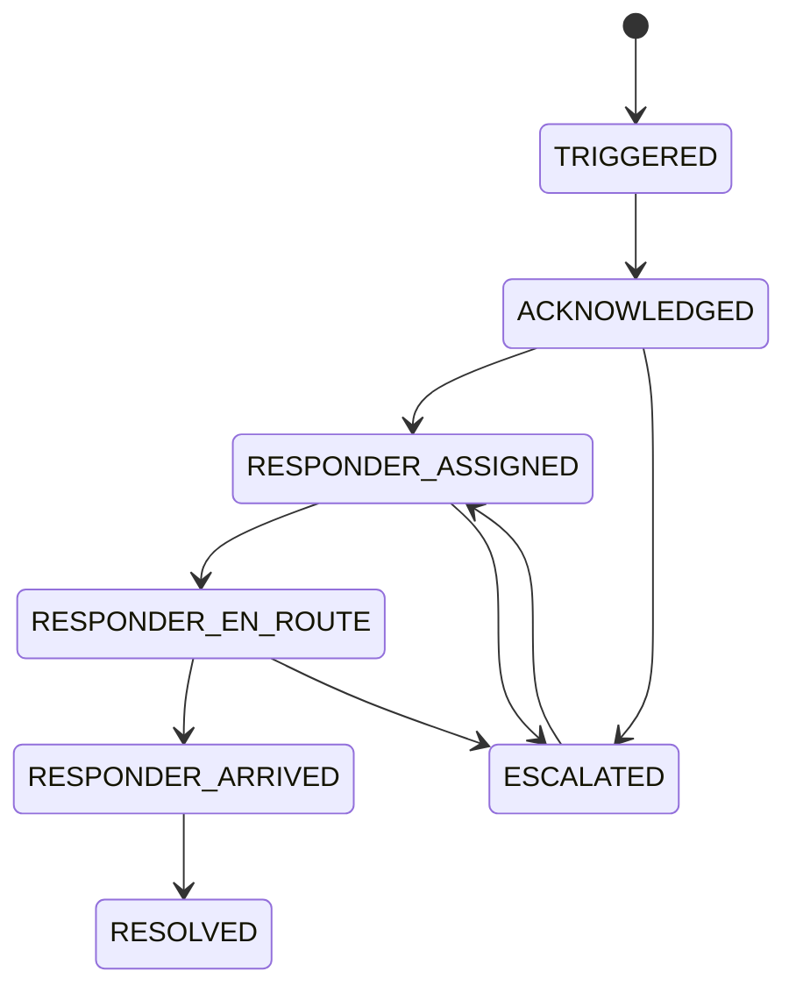

# State Machines

## Ride
The backend uses these persisted ride states:
`REQUESTED → SEARCHING → ASSIGNED → DRIVER_ARRIVING → DRIVER_ARRIVED → IN_PROGRESS → NEAR_DESTINATION → COMPLETED`.

Allowed lifecycle transitions are enforced server-side:
- `ASSIGNED → DRIVER_ARRIVING`
- `DRIVER_ARRIVING → DRIVER_ARRIVED`
- `DRIVER_ARRIVED → IN_PROGRESS`
- `IN_PROGRESS → NEAR_DESTINATION`
- `NEAR_DESTINATION → COMPLETED`
- `IN_PROGRESS → COMPLETED`
- Active rides may also transition to `INTERRUPTED` through recovery/safety flows.

A driver must call `/arriving` and `/arrived` before `/start`; invalid or concurrent transitions are rejected.

## Emergency

## Verification
PENDING → UNDER_VERIFICATION → VERIFIED  
PENDING → UNDER_VERIFICATION → REJECTED → RESUBMITTED → UNDER_VERIFICATION  
Any verified role may move to SUSPENDED or BLOCKED.

## Payment
PENDING → AUTHORIZED → CAPTURED  
CAPTURED → REFUNDED
PENDING → FAILED  
Refunds are tracked separately as `PENDING` / `PROCESSING` → `COMPLETED` or `FAILED`; the payment becomes `REFUNDED` when the non-failed refunded total reaches the captured payment amount.

## Transition rules
Every transition must:
- verify actor permission,
- verify current state,
- verify required preconditions,
- run in a transaction,
- create an event,
- be idempotent where applicable.
