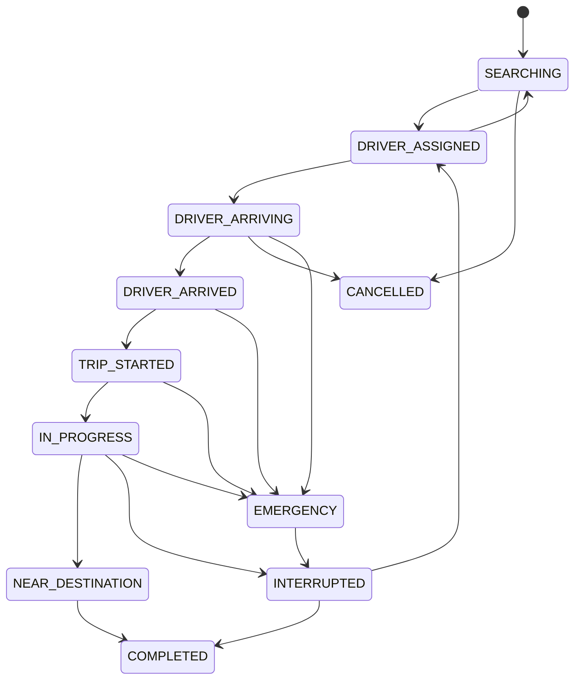
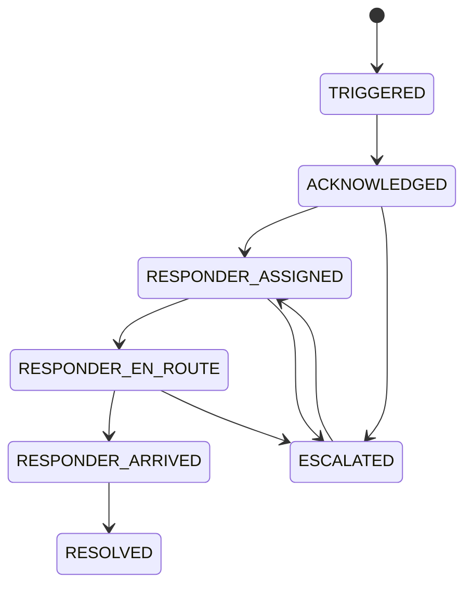

# State Machines

## Ride

## Emergency

## Verification
PENDING → UNDER_VERIFICATION → VERIFIED  
PENDING → UNDER_VERIFICATION → REJECTED → RESUBMITTED → UNDER_VERIFICATION  
Any verified role may move to SUSPENDED or BLOCKED.

## Payment
PENDING → AUTHORIZED → PAID  
PENDING → FAILED  
PAID → REFUND_PENDING → REFUNDED / PARTIALLY_REFUNDED

## Transition rules
Every transition must:
- verify actor permission,
- verify current state,
- verify required preconditions,
- run in a transaction,
- create an event,
- be idempotent where applicable.
